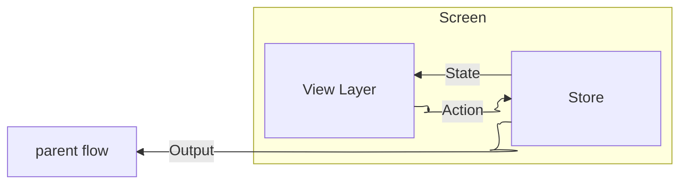
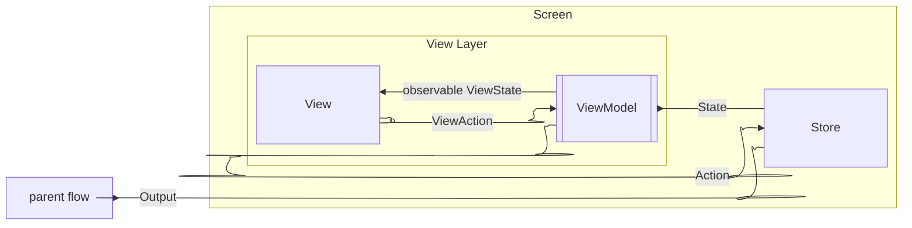
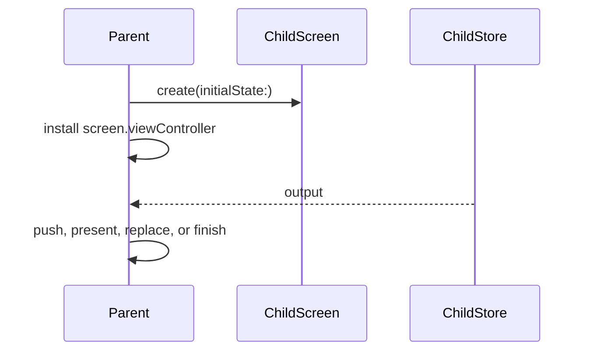

# Lucent

Lucent is a small, SwiftUI-first, unidirectional data flow framework for building screen-oriented apps with explicit state, actions, side effects, and parent-facing outputs. Lucent embraces a declarative core / imperative shell philosophy by anchoring screens to a `UIViewController`. Navigation occurs purely in UIKit, while the view layer is intended to be SwiftUI (UIKit-based screens are equally possible).



## Screens

A Lucent screen is defined by a set of types declared in a `ScreenDefinition`.

- `State`: the screen's private model
- `Action`: events the screen handles
- `Output`: events the screen exposes to its parent

```swift
enum LoginScreen: ScreenDefinition {
  
  struct State: Equatable, Sendable {
    var username: String
    var password: String
    var loggingIn: Bool
  }
  
  enum Action: Equatable, Sendable {
    case userTappedLogin
    case userDidLogin
  }
  
  enum Output: Equatable, Sendable {
    case userDidLogin
  }
}
```

## Store

At runtime, a `Store` owns `State`, handles `Action`s, and optionally emits `Output`.

```swift
final class LoginScreenStore: Store<LoginScreen> {

    override func handleAction(
      action: Action,
      state: inout State,
      store: StoreAccess
    ) {
        switch action {

        case .userTappedLogin:
          // Changes to `state` are applied in a single atomic update.
          state.loggingIn = true
          
          // Here, `store` (a `StoreAccess`) is a mechanism for emitting output,
          // and/or starting long-running tasks - i.e., "side-effects".
          store.runSideEffect { actions in
            // log in, then:
            actions.send(.userDidLogin)
          }
        }
      
	      case .userDidLogin:
      		store.sendOutput(.userDidLogin)
    }
}

```

## View layer

The view layer is created via static func on a `ScreenDefinition`, and wires up the necessary connections. In here, you'll either crate a SwiftUI `View` (as shown below), or a `UIViewController`.

```swift
enum LoginScreen: ScreenDefinition {
  // ...
  
  static func create(initialState: State) -> Screen<Output> {
    let store = LoginScreenStore(state: initialState)
    return Screen(
      view: LoginScreenView(viewModel: store.viewModel),
      store: store
    )
  }
```

The view layer is made up of two parts: a `ViewModel`, and your `View` or view controller.



### ViewModel

Every store has an associated `ViewModel`, which is automatically created by the store, and is accessed via `store.viewModel` (as seen in the above screen creation).

A `ViewModel` exposes `ViewState` and `ViewAction` to the view. These are scoped versions of a screen's `State` and `Action`. By default, `ViewState` == `State` and `ViewAction` == `Action`, but it's best to scope down to only what is needed.

 `ViewModel` excludes `Output` - that is strictly the domain of the `Store`.

#### ViewAction

A store will use `Action`s to communicate within itself, as a serial message queue. Some of these message are semantically private to the store, and shouldn't be exposed to the view. E.g., in the `LoginScreen`, tapping login initiates a long-running side effect that performs a log in, sending an `Action` message back to itself when finished. This "finished logging in" message must not be available in the view layer.

Use the `@ViewActions` and `@ViewAction` macros to declare what's in the `ViewAction`:

```swift
enum LoginScreen: ScreenDefinition {
  // ...
  
  @ViewActions
  enum Action: Sendable {
    // available in the `ViewModel`:
    @viewAction case userTappedLogin
    
    // private to the store:
    case userDidLogin
  }
```

#### ViewState

### Views

#### SwiftUI Views

SwiftUI views use the screen's `ViewModel` directly.

```swift
struct LoginScreenView: View {
    @Bindable var viewModel: ViewModel<LoginScreen>

    var body: some View {
        VStack {
            TextField("Username", text: $viewModel.state.username)
            TextField("Password", text: $viewModel.state.password)
            Button("Login") {
                viewModel.send(action: .userTappedLogin)
            }
            .disabled(viewModel.username.isEmpty || viewModel.password.isEmpty)
        }
        .disabled(viewModel.loggingIn)
    }
}
```

The view reads state through dynamic members, sends `ViewAction`s explicitly, and can bind writable view state through `$viewModel.state`.

##### SwiftUI Previews

For previews, use a detached view model for a static representation:

```swift
#Preview {
  LoginScreenView(
    viewModel: .previewable(
      state: .init()
    )
  }
)
```

Or a `@Previewable` store if you want full store functionality:

```swift
#Preview {
  @Previewable @State var store = LoginScreenStore(
     state: .init()
  )
  LoginScreenView(viewModel: store.viewModel)
}
```

#### UIKit Affordances

UIKit screens use the same `ViewModel`. Conform to `LucentScreen`, send view actions, and observe view state.

```swift
final class CounterViewController: UIViewController, LucentScreen {
    @Bindable var viewModel: ViewModel<CounterScreen>

    private let countLabel = UILabel()
    private let incrementButton = UIButton(type: .system)

    init(viewModel: ViewModel<CounterScreen>) {
        self.viewModel = viewModel
        super.init(nibName: nil, bundle: nil)
    }

    required init?(coder: NSCoder) { fatalError() }

    override func viewDidLoad() {
        super.viewDidLoad()

        incrementButton.onTap(send: .incrementTapped, to: viewModel)

        observe(\.count) { [weak countLabel] count in
            countLabel?.text = "\(count)"
        }
    }
}
```

Lucent also adds SwiftUI-style bindings to common UIKit controls:

```swift
let nameField = UITextField(text: $viewModel.state.name)
let enabledSwitch = UISwitch(isOn: $viewModel.state.isEnabled)
```

Bindings are available for `UITextField`, `UITextView`, `UISwitch`, `UISlider`, `UIStepper`, `UIDatePicker`, `UIPageControl`, `UISegmentedControl`, and `UIColorWell`.

## Flows

> [!NOTE]
>
> Flows are currently under development.
>
> What is represented below is an informal way to use `Screen`s to create flows. This will still be possible once Flows are done, but a new set of types to formalize and ease screen composition will be the only way documented.

Flows compose screens. A parent creates a screen, installs its `viewController`, and observes its `Output`.



Outputs are for crossing screen boundaries. Actions stay inside the screen.

```swift
enum LoginScreen: ScreenDefinition {
    struct State: Sendable { var email = "" }
    enum Action: Sendable { case submitTapped, loginSucceeded(User) }
    enum Output: Sendable { case didLogin(User) }

    static func create(initialState: State) -> Screen<Output> {
        let store = LoginStore(state: initialState)
        return Screen(
            view: LoginView(viewModel: store.viewModel),
            store: store
        )
    }
}

final class LoginStore: Store<LoginScreen> {
    override func handleAction(action: Action, state: inout State, store: StoreAccess) {
        switch action {
        case .submitTapped:
            break
        case .loginSucceeded(let user):
            store.sendOutput(.didLogin(user))
        }
    }
}
```

A parent handles that output and decides what navigation means.

```swift
let login = LoginScreen
    .create(initialState: .init())
    .observe { output in
        guard case let .didLogin(user) = output else { return }
        window.rootViewController = HomeScreen
            .create(initialState: .init(user: user))
            .viewController
    }

window.rootViewController = login.viewController
```

For navigation-controller flows, Lucent provides a small push helper:

```swift
let details = DetailsScreen.create(initialState: .init(id: id))
details.push(onto: navigationController, animated: true)
```

`Screen` also exposes `viewController` directly, so presenting, embedding, tab composition, and custom coordinators stay ordinary UIKit.
